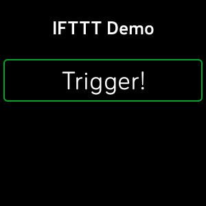

# sdk-ifttt-demo

SDK example which demonstrates how to call a web service (REST API) using
`fetch()`.

This project can trigger an IFTTT Webhook using a Fitbit OS device.

In order to use this demo app, you must create an applet in IFTTT.

* Login to IFTTT.com
* Add a new Applet
* Event: `WebHooks`
* Event Name: `demo_trigger`
* Action: `Send me an email`

You will also need to enter your [IFTTT API
key](https://ifttt.com/services/maker_webhooks/settings) into the app's settings
page.

### Screenshot

